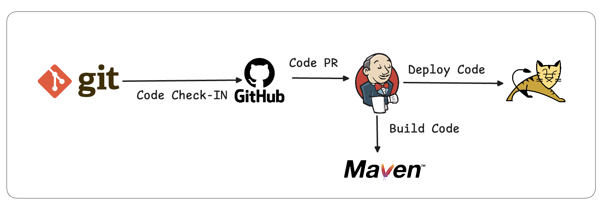
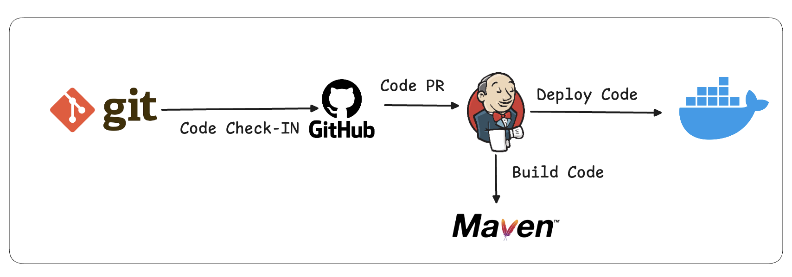
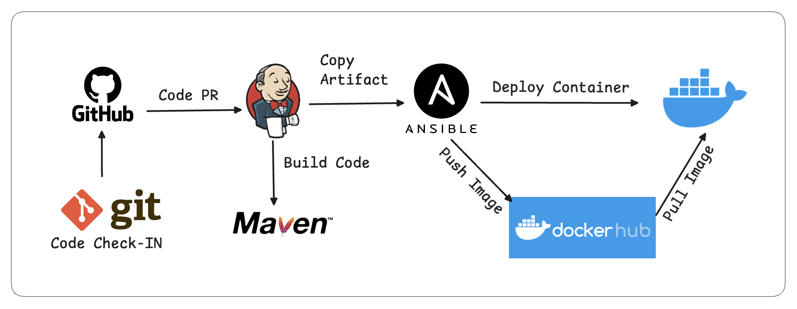
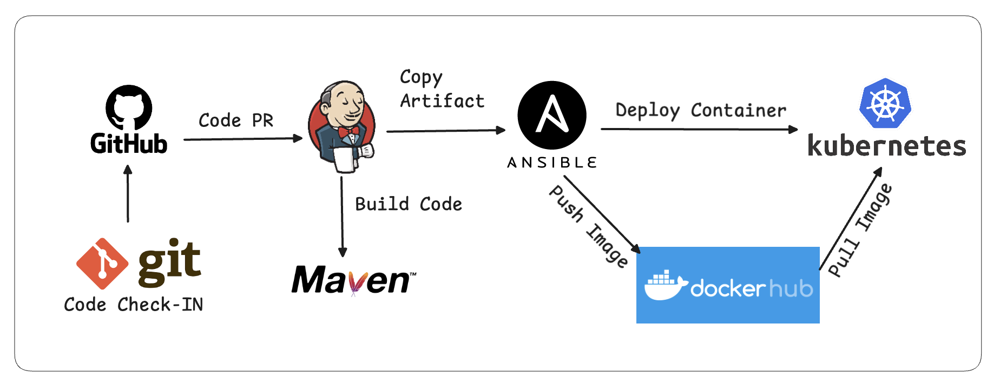

This project demonstrates a complete CI/CD pipeline implementation using Git, Jenkins, Ansible, and Kubernetes. It automates the build, test, deploy, and delivery process of a sample web application, showcasing real-world DevOps practices used in production.

# Project Introduction

### Phase 1 : Code Check-In
this is the phase where the developer writes a code and get it merged into master/main branch post the proper PR Requests. for this we are using the Version control system like Git.

### Phase 2 : Code Build
after the completion of the Code Check-In, we need to build a Artifact for an further deployment. for code build we are using Jenkins

### Phase 3 : Continuous Delivery
after building an artifact from phase 2, we need to get it deployed on a VM or  Docker Container or Kubernetes for that we need continuous delivery solution. in this project we are usign Ansible for this.

---

### Deploy on 3 Environments
1. Deployment of Artifacts on a Tomcat Server
Setting up of Jenkins, Configure Maven, Setup Tomcat server, Integration of GitHub, Maven, Tomcat server with Jenkins and after that we will create a CI and CD Job.



2. Deployment of Artifact on a Container
Setup of CI/CD with GitHub, Jenkins, Maven and Docker. in this setup we are going to setup a Docker environment, write a Dockerfile for deployment, create image and container, integrate docker host with jenkins and then finally create a CI/CD Job on Jenkins to build and deploy on a Container.



3. Deployment of Artifcat on a Container using Various Ansible playbooks. 
fot this we will be doing Setup of an Ansible server, integration of Docker host with Ansible, we will be writing 2 playbooks
* Ansible playbook to create a Docker Image
* Ansible playbook to create a Docker Container


4. Deployment of Artifact on a EKS - Kubernetes Cluster.
for this we are using AWS Managed kubernetes Service called EKS. we will be doing setup of EKS, writing Pod, Service, Deployment manifests, integrate Kubernetes with Ansible, will be writing Ansible playbooks for Deployment and Service Creation and finally CI/CD Job to build code on ansible and deploy it on Kubernetes


# ⚙️ What is CI/CD?

**CI/CD** stands for **Continuous Integration** and **Continuous Delivery/Deployment**.  
It’s a key DevOps practice that enables faster, more reliable, and automated software delivery.

---

## 🔹 Continuous Integration (CI)

Continuous Integration is the process where source code from multiple developers or workstations is **merged frequently** into a central repository (usually the `main` or `master` branch).

Once the code is merged:
- Automated **builds** and **tests** run to validate the new code.
- Any anomalies or integration issues introduced during the merge are detected early.
- This ensures the application remains stable and deployable at all times.

---

## 🔹 Continuous Delivery (CD)

Continuous Delivery focuses on **automating deployments** to various environments such as:
- **Development**
- **Staging**
- **Production**

The deployment may still require **manual approval** before moving to higher environments (like production).  
The main goal is to make every build **deployable on demand** with minimal manual intervention.

---

## 🔹 Continuous Deployment (CD)

If the deployment process is **fully automated** — meaning the application automatically moves from code check-in to production deployment **without manual approval** — it’s called **Continuous Deployment**.

To implement Continuous Deployment effectively, you typically need:
- Multiple environments (Dev → Staging → Prod)
- Robust testing and monitoring pipelines
- Proper rollback mechanisms

---

### 🧩 In summary:
| Stage | Focus | Description |
|--------|--------|-------------|
| **CI** | Integration | Merge code frequently and run automated tests |
| **CD (Delivery)** | Automation | Deploy code to environments with manual approval |
| **CD (Deployment)** | Full Automation | Automatically deploy to production once all tests pass |

---

🚀 **CI/CD** ensures that your software delivery process is **fast, consistent, and reliable**, reducing human errors and increasing developer productivity.

# 🚀 Jenkins Server Setup Guide (on AWS EC2 - Linux)

This guide walks through setting up a **Jenkins Server** on a **Linux EC2 instance** — from instance creation to accessing the Jenkins Web UI.

---

## 🧩 Steps Overview

1. **Spin up a Linux EC2 instance**
2. **Install Java**
3. **Install Jenkins**
4. **Start Jenkins service**
5. **Access Jenkins Web UI**

---

## ⚙️ 1. Launch a Linux EC2 Instance

1. Log in to your **AWS Management Console**.
2. Navigate to **EC2 → Instances → Launch Instance**.
3. Choose:
   - **AMI:** Amazon Linux 2 (or Ubuntu 22.04)
   - **Instance type:** t2.micro (Free tier eligible)
   - **Key pair:** Create or select an existing one
   - **Security group:** Allow ports `22` (SSH), `8080` (Jenkins)
4. Click **Launch Instance**.
5. SSH into your instance:
   ```bash
   ssh -i <your-key.pem> ec2-user@<your-ec2-public-ip>
