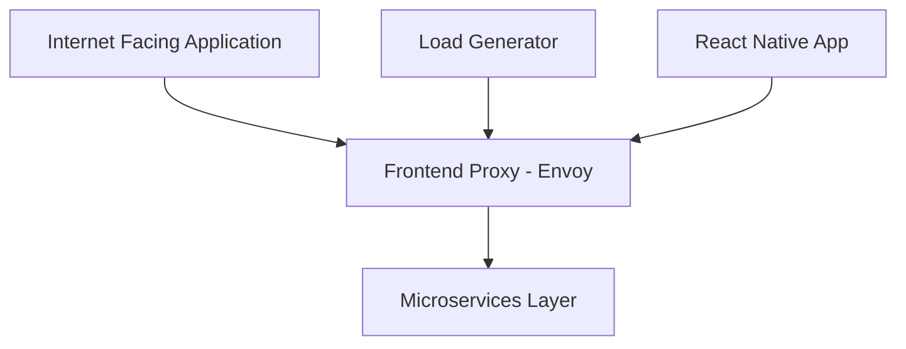
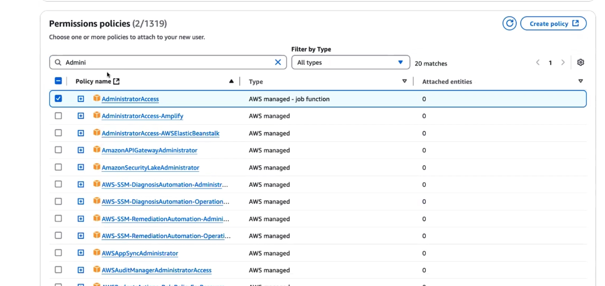
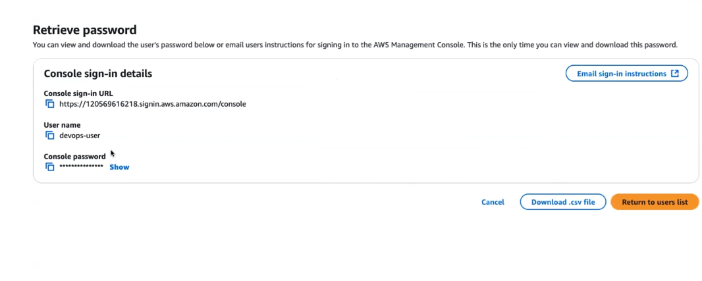

# 🛍️ OpenTelemetry E-Commerce — DevOps Project

[](https://github.com/ajazbeig-21/DevOps-Complete-Repo)
[](https://opentelemetry.io/)
[](https://kubernetes.io/)
[](LICENSE)

A hands-on, real-time DevOps project that deploys the OpenTelemetry E-Commerce demo application using a microservices architecture. Ideal for learning practical observability, container orchestration, and cloud-native deployment while building portfolio-ready experience.

## 📋 Table of Contents

- [About the Project](#about-the-project)
- [Highlights](#highlights)
- [Project Overview](#project-overview)
- [Architecture](#architecture)
- [Microservices](#microservices)
- [Technology Stack](#technology-stack)
- [Getting Started](#getting-started)
- [Learning Outcomes](#learning-outcomes)
- [Interview Preparation](#interview-preparation)
- [Contributing & License](#contributing--license)

## 🎯 About the Project

This repository contains a production-like OpenTelemetry E-Commerce demo tailored for DevOps learning: multi-language microservices, observability with OpenTelemetry, container orchestration with Kubernetes, and modern deployment patterns.

### Why This Project?

- **Real-world Application**: A full microservices e-commerce demo
- **Polyglot Services**: Exposure to multiple backend languages  
- **Observability-First**: Tracing and metrics via OpenTelemetry
- **Career-Focused**: Resume-friendly, interview-oriented exercises

## ✨ Highlights

🚀 **Real-time Project Experience**
- Deploy and operate a distributed system
- Learn lifecycle management of distributed services  
- Handle multi-language microservices environments

🎓 **Practical Learning** 
- Hands-on observability, CI/CD, and infrastructure-as-code
- Industry best practices and real-world scenarios

🛠️ **Professional Development**
- Portfolio-ready artifacts and project experience
- Technical interview preparation and resume enhancement

## 📊 Project Overview

We use the OpenTelemetry E-Commerce demo because it provides a stable, well-documented microservices platform that simulates production scenarios without building everything from scratch.

### Why OpenTelemetry Demo?

| Approach | Description | Complexity |
|----------|-------------|:----------:|
| **Build from Scratch** | Custom application development | ❌ High complexity, limited scope |
| **Use Open Source Demo** | Leverage an established demo | ✅ Industry-standard, well-documented |

The demo offers:

✅ **Microservices-based architecture**  
✅ **Realistic traffic patterns and observability**  
✅ **Comprehensive documentation**  
✅ **Stable and maintained codebase**

## 🏗️ Architecture

The system includes a frontend proxy, a set of backend microservices, and load generators for testing.



### Core Features

- 🛒 **Shopping Cart Management**
- 🚚 **Shipping & Logistics**  
- 🎯 **Product Recommendations**
- 📱 **Multi-platform Support** (web & mobile)
- 🌍 **Multi-currency Support**
- 🔍 **Product Discovery**

## 🔧 Microservices

This demo contains **12+ specialized microservices**, each focused on a single responsibility:

| Service | Icon | Purpose |
|---------|------|---------|
| **Checkout Service** | 🛒 | Order processing and finalization |
| **Cart Service** | 🛍️ | Shopping cart management |
| **Ad Service** | 📢 | Advertisement & promotions |
| **Shipping Service** | 🚚 | Logistics & delivery |
| **Quote Service** | 💰 | Pricing and quotations |
| **Payment Service** | 💳 | Payment processing |
| **Currency Service** | 🌍 | Multi-currency conversions |
| **Email Service** | 📧 | Notifications & emails |
| **Recommendation Service** | 🎯 | Personalized suggestions |
| **Fraud Detection Service** | 🛡️ | Security & fraud checks |
| **Accounting Service** | 📊 | Financial tracking |
| **Feature Flag Service (Flagd)** | 🚩 | Dynamic feature flags |

## 💻 Technology Stack

- **Container Orchestration**: Kubernetes & Docker
- **Service Mesh / Proxy**: Envoy  
- **Observability**: OpenTelemetry (tracing, metrics)
- **Frontend**: React / React Native
- **Backend**: Polyglot microservices
- **Testing**: Load generation tools
- **Infrastructure**: Cloud-native (AWS-ready)

## 🚀 Getting Started

### Prerequisites

- **AWS Account** (free tier is sufficient for many exercises)
- **Docker / Docker Desktop** installed
- **Kubernetes cluster** (local or managed)  
- **Git** and a terminal
- Basic understanding of containerization

### Quick Start

1. **Create AWS IAM User** with minimum required permissions (follow least-privilege best practices)
2. **Clone this repository** and follow the service-specific instructions

**Clone the repository:**

```bash
# Clone the repository
git clone https://github.com/ajazbeig-21/DevOps-Complete-Repo.git

# Navigate to the project directory
cd DevOps-Complete-Repo/projects/Otel-DevOps-Project

# Review individual service READMEs for setup and deployment steps
```

### IAM Setup Notes

Understanding AWS IAM is crucial for this project:

- **Authentication**: Handled by users and user groups
- **Authorization**: Enforced via IAM roles and policies  
- **Least Privilege**: Grant only the permissions that are needed

**Analogy**: Think of a bank where a regular customer has access only to the lobby and teller counter, while a bank manager can enter secured areas. Use IAM roles to model these access differences.

When creating an IAM user for initial setup, you may attach administrative access for convenience during early exploration. If you do so, store credentials securely and rotate them after use.



When creating the user, optionally require a password change at first sign-in and store credentials securely.



### Setting up AWS EC2 Instance

1. **Launch EC2 Instance**
   - Use AWS EC2 service to create a virtual machine
   - Choose Ubuntu AMI and instance type `t2.large`
   - Create a key pair:
     - For Windows: download `.ppk` file
     - For Linux/macOS: download `.pem` file
   - Allow SSH traffic and assign a public IP

2. **Connect to the Instance**
   
   Wait for the instance state to show "running", then connect:

   ```bash
   # Set proper permissions for the key file
   chmod 400 <your-key-file.pem>
   
   # Connect to the instance
   ssh -i <your-key-file.pem> ubuntu@<public-ip-address>
   ```

   > **Note**: If you get "Access denied. .pem file permission are too open" error, make sure to run the `chmod 400` command first.

### Docker Installation

For detailed Docker installation instructions, see:  
[Docker Installation Guide](./content/docker-Installation.md)

---

### Docker Lifecycle & Collaboration

There is also a Docker lifecycle and collaboration workflow to follow when working as a DevOps engineer:  
[Docker Lifecycle and Collaboration](./content/docker-lifecycle-and-collaboration.md)

### Solution for the common issues you may face during this project

[Common Issues](./content/common-issues.md)

### I have created an README.md to Create a Dockerfile for various programming languages like Go, Python, Java and JavaScript

- **Go Dockerfile** : [Go](./content/Go-Language-product-catalog-microservice.md)

## 📚 Learning Outcomes

By working through this project, you will gain expertise in:

- **Microservices Architecture**: Design and deployment patterns
- **Container Orchestration**: Kubernetes management and scaling  
- **Service Communication**: Inter-service networking and discovery
- **Observability**: Monitoring, logging, and tracing with OpenTelemetry
- **DevOps Practices**: CI/CD and Infrastructure as Code
- **Multi-language Environments**: Polyglot microservices management
- **Production Deployment**: Real-world deployment scenarios

## 💼 Interview Preparation

This project prepares you for technical interviews by covering:

- **System Design Questions**: Microservices architecture patterns
- **DevOps Scenarios**: Real-world problem-solving  
- **Technology Deep-dives**: Multi-language stack discussions
- **Best Practices**: Industry-standard approaches
- **Troubleshooting**: Common issues and solutions

## 🤝 Contributing & License

**Contributing**: We welcome contributions! Please open issues or pull requests. See the repository guidelines for contribution details.

**License**: This project is licensed under Apache 2.0. See the [LICENSE](LICENSE) file for details.

---

<div align="center">

**Ready to level up your DevOps skills?** 🚀

[Get Started](#getting-started) | [View Documentation](docs/) | [Contributing](#contributing--license)

</div>