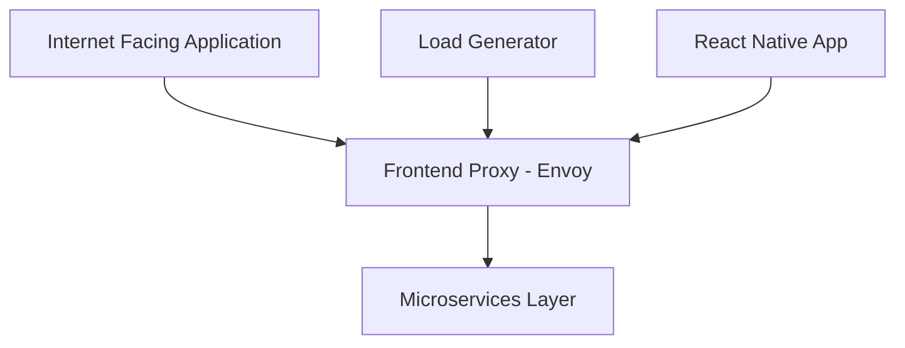

[# 🛍️ OpenTelemetry E-Commerce — DevOps Project
](#)

[](https://github.com/ajazbeig-21/DevOps-Complete-Repo)
[](https://opentelemetry.io/)
[](https://kubernetes.io/)
[](LICENSE)

A hands-on, real-time DevOps project that deploys the OpenTelemetry E-Commerce demo application using a microservices architecture. Ideal for learning practical observability, container orchestration, and cloud-native deployment while building portfolio-ready experience.

## 📋 Table of contents

- [About the project](#about-the-project)
- [Highlights](#highlights)
- [Overview](#project-overview)
- [Architecture](#architecture)
- [Microservices](#microservices)
- [Tech stack](#technology-stack)
- [Getting started](#getting-started)
- [Learning outcomes](#learning-outcomes)
- [Interview preparation](#interview-preparation)
- [Contributing & License](#contributing--license)

## About the project

This repository contains a production-like OpenTelemetry E-Commerce demo tailored for DevOps learning: multi-language microservices, observability with OpenTelemetry, container orchestration with Kubernetes, and modern deployment patterns.

Why this project?

- Real-world application: a full microservices e-commerce demo
- Polyglot services: exposure to multiple backend languages
- Observability-first: tracing and metrics via OpenTelemetry
- Career-focused: resume-friendly, interview-oriented exercises

## Highlights

- Real-time project experience: deploy and operate a distributed system
- Practical learning: hands-on observability, CI/CD, and infra-as-code
- Professional development: portfolio-ready artifacts and interview prep

## Project overview

We use the OpenTelemetry E-Commerce demo because it provides a stable, well-documented microservices platform that simulates production scenarios without building everything from scratch.

Comparison:

| Approach | Description | Complexity |
|---|---:|:---:|
| Build from scratch | Custom application development | ❌ High |
| Use open-source demo | Leverage an established demo | ✅ Recommended |

The demo offers:

- Microservices architecture
- Realistic traffic patterns and observability
- Clear documentation and a maintained codebase

## Architecture

The system includes a frontend proxy, a set of backend microservices, and load generators for testing.



Core features:

- 🛒 Shopping cart and checkout
- 🚚 Shipping & logistics
- 🎯 Recommendations and personalization
- 📱 Multi-platform (web & mobile) support
- 🌍 Multi-currency support

## Microservices

This demo contains 12+ services; each is focused on a single responsibility:

| Service | Purpose |
|---|---|
| Checkout Service | Order processing and finalization |
| Cart Service | Shopping cart management |
| Ad Service | Advertisement & promotions |
| Shipping Service | Logistics & delivery |
| Quote Service | Pricing and quotations |
| Payment Service | Payment processing |
| Currency Service | Multi-currency conversions |
| Email Service | Notifications & emails |
| Recommendation Service | Personalized suggestions |
| Fraud Detection Service | Security & fraud checks |
| Accounting Service | Financial tracking |
| Feature Flag Service (Flagd) | Dynamic feature flags |

## Technology stack

- Container orchestration: Kubernetes & Docker
- Service mesh / proxy: Envoy
- Observability: OpenTelemetry (tracing, metrics)
- Frontend: React / React Native
- Backend: Polyglot microservices
- Testing: Load generation tools
- Infrastructure: Cloud-native (AWS-ready)

## Getting started

### Prerequisites

- An AWS account (free tier is sufficient for many exercises)
- Docker / Docker Desktop
- A Kubernetes cluster (local or managed)
- Git and a terminal

### Quick start

1. Create an AWS IAM user with the minimum required permissions. (This project includes examples for RBAC/ABAC patterns; follow least-privilege best practices.)
2. Download or clone this repository and follow the service-specific instructions in each service folder.

Clone the repo and change into the project directory:

```bash
# Clone the repository
git clone https://github.com/ajazbeig-21/DevOps-Complete-Repo.git

# Open the e-commerce demo project
cd DevOps-Complete-Repo/projects/Otel-DevOps-Project

# Review individual service READMEs for setup and deployment steps
```

IAM notes (brief):

- Authentication is handled by users and groups.
- Authorization is enforced via IAM roles and policies.
- Apply least-privilege: grant only the permissions that are needed.

Example (UX flow analogy): a regular bank customer has access only to the lobby and teller counter, while a bank manager can enter secured areas. Use IAM roles to model these access differences.

When creating an IAM user for initial setup you may attach administrative access for convenience during early exploration. If you do so, store credentials securely and rotate them after use.


When creating the user, optionally require a password change at first sign-in and store credentials securely.


## Learning outcomes

By working through this project you will learn:

- Microservices design and deployment patterns
- Kubernetes management and scaling
- Inter-service communication, service mesh basics
- Observability: tracing, metrics, and logs with OpenTelemetry
- CI/CD and infrastructure-as-code workflows
- Managing polyglot services in production-like environments

## Interview preparation

This project prepares you for typical DevOps and system-design interviews by covering:

- Microservices architecture questions
- Observability and monitoring design
- CI/CD and deployment strategies
- Troubleshooting and incident response scenarios

## Contributing & License

Contributions are welcome — please open issues or pull requests. See the repository guidelines for contribution details.

This project is licensed under Apache 2.0. See `LICENSE` for details.

---

<div align="center">

**Ready to level up your DevOps skills?** 🚀

[Get Started](#getting-started) | [View Documentation](docs/) | [Join Community](#support)

</div>