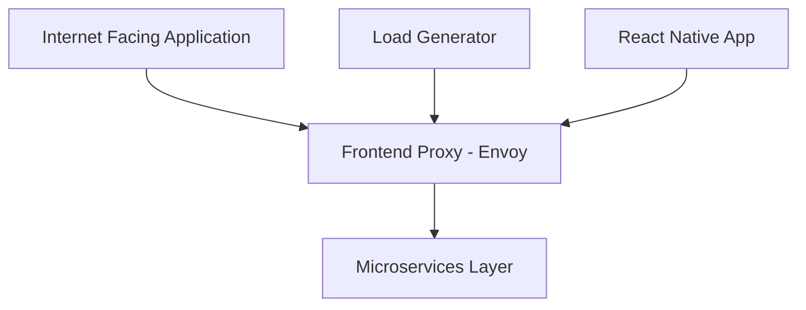

# 🛍️ OpenTelemetry E-Commerce DevOps Project

[](https://github.com/ajazbeig-21/DevOps-Complete-Repo)
[](https://opentelemetry.io/)
[](https://kubernetes.io/)
[](LICENSE)

> A comprehensive real-time DevOps project featuring microservices architecture deployment using the OpenTelemetry E-Commerce demo application. Perfect for hands-on learning, resume building, and interview preparation.

## 📋 Table of Contents

- [About the Project](#-about-the-project)
- [Key Highlights](#-key-highlights)
- [Project Overview](#-project-overview)
- [Architecture](#-architecture)
- [Microservices](#-microservices)
- [Technology Stack](#-technology-stack)
- [Getting Started](#-getting-started)
- [Learning Outcomes](#-learning-outcomes)
- [Interview Preparation](#-interview-preparation)

## 🎯 About the Project

This project is designed as the **only course you need** for implementing real-time DevOps practices. It combines practical implementation with comprehensive resume preparation and interview question coverage that you can expect in the industry.

### Why This Project?

- **Real-world Application**: Work with a production-grade e-commerce platform
- **Multi-language Exposure**: Gain experience with microservices written in various programming languages
- **Industry Relevance**: Learn skills that directly apply to enterprise environments
- **Career Focused**: Resume building and interview preparation integrated throughout

## ✨ Key Highlights

🚀 **Real-time Project Experience**
- Deploy a complete e-commerce platform with microservices architecture
- Learn lifecycle management of distributed services
- Handle multi-language microservices environments

🎓 **Comprehensive Learning**
- Practical implementation focus
- Resume enhancement strategies
- Interview preparation with expected questions
- Industry best practices

🛠️ **Professional Development**
- Project portfolio building
- Technical interview readiness
- Real-world DevOps scenarios

## 📊 Project Overview

We'll be deploying the **OpenTelemetry E-Commerce Demo Project** - a sophisticated, microservices-based application that serves as an ideal learning platform.

### Why OpenTelemetry Demo?

When learning DevOps, we need a robust application to work with. We have two approaches:

| Approach | Description | Complexity |
|----------|-------------|------------|
| **Build from Scratch** | Develop a custom application | ❌ High complexity, limited scope |
| **Use Open Source Demo** | Leverage proven applications | ✅ Industry-standard, well-documented |

We've chosen the OpenTelemetry demo because it offers:

✅ **Microservices-based architecture**  
✅ **Real-time production scenarios**  
✅ **Comprehensive documentation**  
✅ **Stable and maintained codebase**  

## 🏗️ Architecture

Our e-commerce platform includes modern web application components:



### Core Features

- 🛒 **Shopping Cart Management**
- 🚚 **Shipping & Logistics**
- 💡 **Product Recommendations**
- 📱 **Multi-platform Support**
- 💰 **Currency Selection**
- 🔍 **Product Discovery**

## 🔧 Microservices

Our platform consists of **12+ specialized microservices**, each handling specific business logic:

| Service | Description | Purpose |
|---------|-------------|---------|
| **Checkout Service** | 🛒 | Order processing and finalization |
| **Cart Service** | 🛍️ | Shopping cart management |
| **Ad Service** | 📢 | Advertisement and promotions |
| **Shipping Service** | 🚚 | Logistics and delivery |
| **Quote Service** | 💰 | Pricing and quotations |
| **Payment Service** | 💳 | Payment processing |
| **Currency Service** | 🌍 | Multi-currency support |
| **Email Service** | 📧 | Notifications and communications |
| **Recommendation Service** | 🎯 | Personalized suggestions |
| **Fraud Detection Service** | 🛡️ | Security and fraud prevention |
| **Accounting Service** | 📊 | Financial tracking |
| **Feature Flag Service (Flagd)** | 🚩 | Dynamic feature management |

## 💻 Technology Stack

- **Container Orchestration**: Kubernetes, Docker
- **Service Mesh**: Envoy Proxy
- **Observability**: OpenTelemetry
- **Frontend**: React, React Native
- **Backend**: Multiple languages (polyglot architecture)
- **Testing**: Load Generation tools
- **Infrastructure**: Cloud-native deployment

## 🚀 Getting Started

### Prerequisites

- Docker Desktop installed
- Kubernetes cluster access
- Basic understanding of containerization
- Git for version control

### Quick Start

```bash
# Clone the repository
git clone https://github.com/ajazbeig-21/DevOps-Complete-Repo.git

# Navigate to the project
cd DevOps-Complete-Repo/projects/Otel-DevOps-Project

# Follow the setup instructions (coming soon)
```

## 📚 Learning Outcomes

By completing this project, you will gain expertise in:

- **Microservices Architecture**: Design and deployment patterns
- **Container Orchestration**: Kubernetes management and scaling
- **Service Communication**: Inter-service networking and discovery
- **Observability**: Monitoring, logging, and tracing
- **DevOps Practices**: CI/CD, Infrastructure as Code
- **Multi-language Environments**: Polyglot microservices management
- **Production Deployment**: Real-world deployment scenarios

## 💼 Interview Preparation

This project prepares you for technical interviews by covering:

- **System Design Questions**: Microservices architecture patterns
- **DevOps Scenarios**: Real-world problem-solving
- **Technology Deep-dives**: Multi-language stack discussions
- **Best Practices**: Industry-standard approaches
- **Troubleshooting**: Common issues and solutions

---

## 🤝 Contributing

We welcome contributions! Please see our contributing guidelines for more details.

## 📄 License

This project is licensed under the Apache 2.0 License - see the [LICENSE](LICENSE) file for details.

## 📞 Support

For questions and support:
- Open an issue in this repository
- Join our community discussions
- Follow the project documentation

---

<div align="center">

**Ready to level up your DevOps skills?** 🚀

[Get Started](#-getting-started) | [View Documentation](docs/) | [Join Community](#-support)

</div>