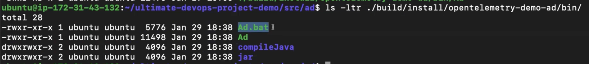

# Java Language Ads Microservice

This document provides instructions for setting up, building, and running the Java-based ads microservice using Gradle.

## Prerequisites

Before building and running the microservice, ensure you have the following installed:

- Java 21 (or compatible version)
  ```bash
  sudo apt install openjdk-21-jre-headless
  ```

## Build Tool: Gradle

Gradle is the build tool used for this Java-based project. It handles dependency management, compilation, and packaging.

The project includes:
- `gradlew` (Gradle wrapper for macOS/Linux)
- `gradlew.bat` (Gradle wrapper for Windows)
- `settings.gradle` for basic Gradle properties
- `gradle/wrapper/` directory with additional configuration files

## Building the Project

1. Read the instructions in `README.md` carefully.

2. Make the Gradle wrapper executable (if necessary):
   ```bash
   chmod +x ./gradlew
   ```

3. Run the Gradle wrapper to build the project:
   ```bash
   ./gradlew installDist
   ```

   This command performs several tasks:
   - Starts the Gradle daemon (background process for Java builds)
   - Downloads and installs dependencies
   - Compiles the source code
   - Builds the application and places it in the specified location

   The build artifacts will be created in the `build/` directory, with the executable located inside.

   

## Running the Service

1. Set the required environment variables:
   ```bash
   export AD_PORT=9099
   export FEATURE_FLAG_GRPC_SERVICE_ADDR=featureflagservice:50053
   ```

2. Run the service:
   ```bash
   ./build/install/opentelemetry-demo-ad/bin/Ad
   ```

## Additional Notes

- Ensure all prerequisites are met before building.
- The service will start on the port specified by `AD_PORT`.
- The feature flag service address should be accessible for proper functionality.

Now lets create a Dockerfile

```dockerfile
# Multi-stage build: First stage for building the application
FROM eclipse-temurin:21-jdk AS builder

# Set working directory in the container
WORKDIR /usr/src/app/

# Copy Gradle wrapper and configuration files first (for better caching)
COPY gradlew* settings.gradle* build.gradle .
COPY ./gradle ./gradle

# Make Gradle wrapper executable
RUN chmod +x ./gradlew

# Download Gradle dependencies (without building)
RUN ./gradlew
RUN ./gradlew downloadRepos

# Copy source code
COPY . .

# Copy protobuf files if needed
COPY ./pb ./proto

# Make sure wrapper is executable again
RUN chmod +x ./gradlew

# Build the application distribution
RUN ./gradlew installDist -PprotoSourceDir=./proto

####################
# Second stage: Runtime image (smaller, only JRE needed)
FROM eclipse-temurin:21-jre

# Set working directory
WORKDIR /usr/src/app

# Copy built application from builder stage
COPY --from=builder /usr/src/app ./

# Set environment variable for the port
ENV AD_PORT 9099

# Define the entrypoint to run the application
ENTRYPOINT ["./build/install/opentelemetry-demo-ad/bin/Ad"]
```

## Building and Running with Docker

Build the Docker image:
```bash
docker build -t abhishekf5/adservice:v1 .
```

Run the container:
```bash
docker run abhishekhf5/adservice:v1
```

## Testing the Service

Once the service is running, you can test it by making HTTP requests to the configured port (9099).

Example test commands:
```bash
# Check if service is responding
curl http://localhost:9099/health

# Get ads for a specific context
curl "http://localhost:9099/ads?context_keys=sample_context"
```

## Configuration

The service can be configured using the following environment variables:

- `AD_PORT`: Port on which the service listens (default: 9099)
- `FEATURE_FLAG_GRPC_SERVICE_ADDR`: Address of the feature flag gRPC service (default: featureflagservice:50053)

## Troubleshooting

### Common Issues

1. **Port already in use**: Make sure port 9099 is available or change the `AD_PORT` environment variable.

2. **Feature flag service unreachable**: Ensure the feature flag service is running and accessible at the configured address.

3. **Build failures**: Check that all dependencies are available and Java 21 is properly installed.

### Logs

To view application logs when running in Docker:
```bash
docker logs <container_id>
```

For local execution, logs will be printed to the console.

## Development

To modify the service:

1. Make changes to the source code
2. Rebuild using `./gradlew installDist`
3. Restart the service

For Docker development:
1. Make code changes
2. Rebuild the Docker image
3. Run the new container