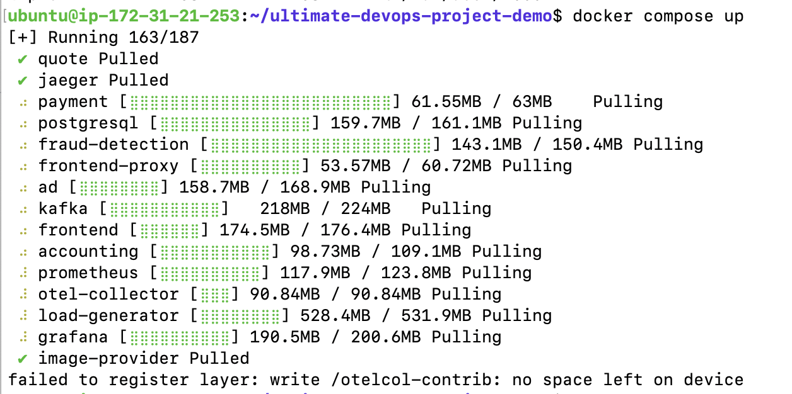
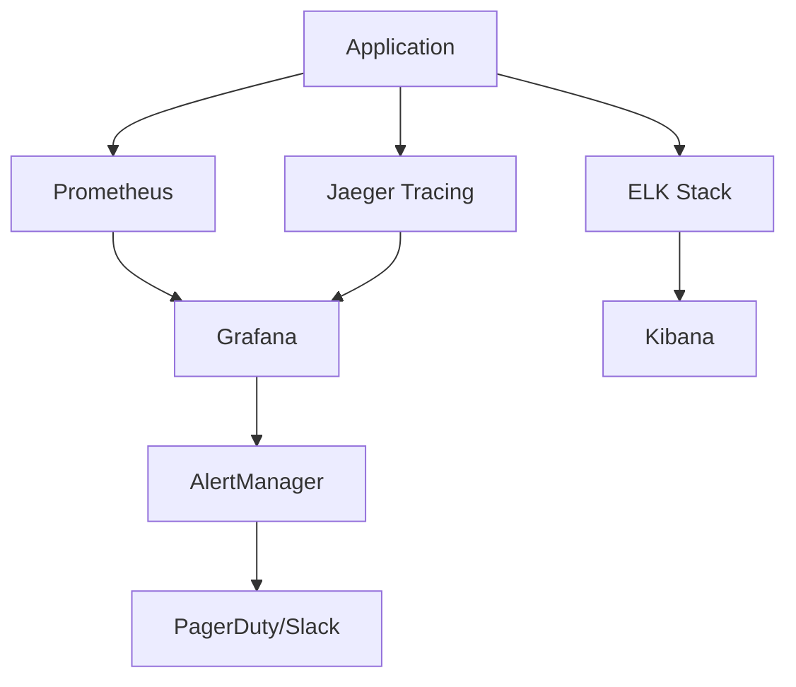

# 🚨 Common DevOps Issues & Solutions

[](https://github.com/ajazbeig-21/DevOps-Complete-Repo)
[](https://github.com/ajazbeig-21/DevOps-Complete-Repo)
[](https://github.com/ajazbeig-21/DevOps-Complete-Repo)

> **Production-grade troubleshooting guide**: Real-world issues encountered in DevOps environments with comprehensive solutions, prevention strategies, and interview preparation content.

## 📋 Table of Contents

- [Storage & Disk Issues](#-storage--disk-issues)
- [Container & Docker Issues](#-container--docker-issues)
- [Kubernetes Issues](#-kubernetes-issues)
- [Network & Connectivity](#-network--connectivity)
- [Performance & Resource Issues](#-performance--resource-issues)
- [CI/CD Pipeline Issues](#-cicd-pipeline-issues)
- [Security & Access Issues](#-security--access-issues)
- [Interview Question Bank](#-interview-question-bank)
- [Prevention Strategies](#-prevention-strategies)
- [Monitoring & Alerting](#-monitoring--alerting)

---

## 💽 Storage & Disk Issues

### 🔴 Issue #1: Disk Space Exhausted

#### **Problem Description**
```bash
# Common error messages
df: /dev/nvme0n1p1: No space left on device
docker: Error response from daemon: no space left on device
kubectl: pod evicted due to disk pressure
```

#### **Visual Reference**


#### **Root Causes**
- 📊 **Log file accumulation** (`/var/log/*`)
- 🐳 **Docker images/containers** taking up space
- 📦 **Package cache** not cleaned (`/var/cache/apt/`)
- 🗃️ **Temporary files** in `/tmp`
- 💾 **Database growth** without rotation

#### **Immediate Solutions**

##### 🚀 **Quick Fix (Emergency)**
```bash
# Check disk usage
df -h
du -sh /* 2>/dev/null | sort -hr | head -10

# Clean common space consumers
sudo apt-get clean
sudo journalctl --vacuum-time=7d
docker system prune -af
sudo rm -rf /tmp/*
```

##### 🔧 **Volume Expansion (AWS/Cloud)**
```bash
# Step 1: Increase EBS volume in AWS Console
# Go to EC2 > Volumes > Select Volume > Actions > Modify Volume

# Step 2: Install required utilities
sudo apt-get update
sudo apt-get install cloud-guest-utils

# Step 3: Extend partition
sudo growpart /dev/nvme0n1 1

# Step 4: Resize filesystem
sudo resize2fs /dev/nvme0n1p1

# Step 5: Verify expansion
df -h
```

##### 🛠️ **Advanced Disk Management**
```bash
# Find largest directories
sudo du -h --max-depth=1 / 2>/dev/null | sort -hr

# Clean Docker completely
docker system df  # Check Docker disk usage
docker system prune -a --volumes  # Clean everything

# Log rotation setup
sudo logrotate -f /etc/logrotate.conf

# Check inode usage (sometimes the issue)
df -i
```

#### **Prevention Strategies**
```bash
# Set up automatic cleanup (crontab -e)
0 2 * * * docker system prune -f
0 3 * * 0 sudo apt-get autoremove -y
0 4 * * * sudo journalctl --vacuum-time=30d

# Monitor disk usage
echo 'df -h | awk '\''NR==1 || /80%/{print $0}'\''' >> ~/.bashrc
```

---

## 🐳 Container & Docker Issues

### 🔴 Issue #2: Container Won't Start

#### **Common Scenarios**
```bash
# Port already in use
Error: bind: address already in use

# Permission denied
Permission denied while trying to connect to Docker daemon

# Image not found
Unable to find image 'myapp:latest' locally
```

#### **Solutions**

##### **Port Conflicts**
```bash
# Find process using port
sudo netstat -tulpn | grep :8080
sudo lsof -i :8080

# Kill process or use different port
sudo kill -9 <PID>
docker run -p 8081:8080 myapp:latest
```

##### **Docker Daemon Issues**
```bash
# Check Docker status
sudo systemctl status docker

# Restart Docker service
sudo systemctl restart docker

# Add user to docker group
sudo usermod -aG docker $USER
newgrp docker
```

##### **Image Management**
```bash
# List all images
docker images -a

# Remove dangling images
docker image prune

# Build with no-cache
docker build --no-cache -t myapp:latest .
```

---

## ☸️ Kubernetes Issues

### 🔴 Issue #3: Pod CrashLoopBackOff

#### **Diagnosis Commands**
```bash
# Check pod status
kubectl get pods -o wide

# Describe problematic pod
kubectl describe pod <pod-name>

# Check logs
kubectl logs <pod-name> --previous
kubectl logs <pod-name> -f

# Get events
kubectl get events --sort-by=.metadata.creationTimestamp
```

#### **Common Fixes**
```bash
# Resource limits
kubectl patch deployment myapp -p '{"spec":{"template":{"spec":{"containers":[{"name":"myapp","resources":{"limits":{"memory":"1Gi","cpu":"500m"}}}]}}}}'

# ConfigMap/Secret issues
kubectl get configmaps
kubectl describe secret <secret-name>

# Image pull issues
kubectl patch deployment myapp -p '{"spec":{"template":{"spec":{"imagePullPolicy":"Always"}}}}'
```

---

## 🌐 Network & Connectivity

### 🔴 Issue #4: Service Mesh Communication

#### **Istio/Envoy Issues**
```bash
# Check sidecar injection
kubectl get pods -o jsonpath='{.items[*].spec.containers[*].name}'

# Proxy configuration
istioctl proxy-config cluster <pod-name>
istioctl analyze

# Traffic policies
kubectl get destinationrules
kubectl get virtualservices
```

---

## 📈 Performance & Resource Issues

### 🔴 Issue #5: High Memory/CPU Usage

#### **Monitoring Commands**
```bash
# System resources
top
htop
iostat 1
vmstat 1

# Container resources
docker stats
kubectl top nodes
kubectl top pods

# Memory analysis
free -h
cat /proc/meminfo
sudo sysctl vm.swappiness=10
```

#### **Optimization Strategies**
```yaml
# Kubernetes resource management
apiVersion: v1
kind: Pod
spec:
  containers:
  - name: myapp
    resources:
      requests:
        memory: "256Mi"
        cpu: "250m"
      limits:
        memory: "512Mi"
        cpu: "500m"
```

---

## 🔄 CI/CD Pipeline Issues

### 🔴 Issue #6: Pipeline Failures

#### **Jenkins Issues**
```bash
# Check Jenkins logs
sudo journalctl -u jenkins -f

# Workspace cleanup
rm -rf /var/lib/jenkins/workspace/*

# Plugin issues
java -jar jenkins-cli.jar -s http://localhost:8080/ list-plugins
```

#### **GitLab CI/CD**
```yaml
# .gitlab-ci.yml debugging
variables:
  CI_DEBUG_TRACE: "true"

before_script:
  - echo "Debug info"
  - env | grep -E '^(CI_|GITLAB_)'
  - docker --version
  - kubectl version --client
```

---

## 🔒 Security & Access Issues

### 🔴 Issue #7: RBAC and Permissions

#### **Kubernetes RBAC**
```bash
# Check current permissions
kubectl auth can-i create pods
kubectl auth can-i create pods --as=system:serviceaccount:default:mysa

# Debug RBAC
kubectl get rolebindings,clusterrolebindings --all-namespaces -o wide
```

#### **Docker Security**
```bash
# Run security scans
docker run --rm -v /var/run/docker.sock:/var/run/docker.sock \
  -v $(pwd):/root/.cache/ aquasec/trivy image myapp:latest

# Check for vulnerabilities
docker run --rm -v /var/run/docker.sock:/var/run/docker.sock \
  -v $(pwd):/tmp anchore/grype myapp:latest
```

---

## 💼 Interview Question Bank

### 🎯 **Behavioral Questions**

#### **Q1: Describe a critical production issue you resolved**
**Sample Answer:**
> "We had a microservices application experiencing cascading failures. The payment service was timing out, causing order failures. I implemented circuit breakers using Istio, added proper timeouts, and established bulkhead patterns. The resolution time was reduced from 4 hours to 30 minutes for similar issues."

#### **Q2: How do you approach troubleshooting in production?**
**Framework:**
1. **Assess Impact** - User experience, business metrics
2. **Gather Data** - Logs, metrics, traces
3. **Hypothesis** - Form theories based on data
4. **Test & Validate** - Controlled testing
5. **Implement Fix** - Gradual rollout
6. **Post-mortem** - Document learnings

### 🔧 **Technical Questions**

#### **Q3: How would you debug a Kubernetes pod that keeps restarting?**
```bash
# Step-by-step approach
1. kubectl describe pod <pod-name>  # Check events
2. kubectl logs <pod-name> --previous  # Previous logs
3. kubectl exec -it <pod-name> -- /bin/sh  # Interactive debug
4. Check resource limits and requests
5. Verify image and configuration
6. Check liveness/readiness probes
```

#### **Q4: Explain Docker layers and how they affect troubleshooting**
```dockerfile
# Example showing layer optimization
FROM node:16-alpine AS builder
WORKDIR /app
COPY package*.json ./
RUN npm ci --only=production  # Layer cached if package.json unchanged

FROM node:16-alpine
WORKDIR /app
COPY --from=builder /app/node_modules ./node_modules
COPY . .
CMD ["npm", "start"]
```

#### **Q5: How do you handle secrets rotation in Kubernetes?**
```bash
# External Secrets Operator approach
apiVersion: external-secrets.io/v1beta1
kind: SecretStore
metadata:
  name: vault-backend
spec:
  provider:
    vault:
      server: "https://vault.example.com"
      path: "secret"
```

### 🏗️ **Architecture Questions**

#### **Q6: Design a monitoring strategy for microservices**


**Components:**
- **Metrics**: Prometheus + Grafana
- **Tracing**: Jaeger/Zipkin
- **Logging**: ELK/EFK Stack
- **Alerting**: AlertManager + PagerDuty

---

## 🛡️ Prevention Strategies

### 📊 **Proactive Monitoring**

#### **Essential Metrics to Monitor**
```yaml
# Prometheus rules
groups:
- name: infrastructure
  rules:
  - alert: DiskSpaceHigh
    expr: (1 - node_filesystem_avail_bytes / node_filesystem_size_bytes) * 100 > 80
    for: 5m
    
  - alert: PodCrashLooping
    expr: increase(kube_pod_container_status_restarts_total[15m]) > 0
    for: 5m
    
  - alert: HighErrorRate
    expr: rate(http_requests_total{status=~"5.."}[5m]) > 0.1
    for: 2m
```

### 🔄 **Automation Scripts**

#### **Health Check Automation**
```bash
#!/bin/bash
# health-check.sh

check_disk_space() {
    usage=$(df / | awk 'NR==2 {print $5}' | sed 's/%//')
    if [ $usage -gt 80 ]; then
        echo "WARNING: Disk usage is $usage%"
        # Trigger cleanup
        docker system prune -f
        sudo journalctl --vacuum-time=7d
    fi
}

check_services() {
    services=("docker" "kubelet" "nginx")
    for service in "${services[@]}"; do
        if ! systemctl is-active --quiet $service; then
            echo "ERROR: $service is not running"
            systemctl restart $service
        fi
    done
}

# Run checks
check_disk_space
check_services
```

---

## 📱 Monitoring & Alerting

### 🚨 **Alert Severity Levels**

| Level | Response Time | Escalation | Examples |
|-------|---------------|------------|----------|
| 🔥 **Critical** | 5 minutes | Immediate page | Service down, data loss |
| ⚠️ **Warning** | 30 minutes | Slack notification | High latency, resource usage |
| ℹ️ **Info** | 2 hours | Email/ticket | Deployment success, capacity planning |

### 📈 **Dashboards Structure**
```json
{
  "dashboard": {
    "title": "Production Overview",
    "panels": [
      {
        "title": "System Health",
        "type": "stat",
        "targets": ["up{job='node-exporter'}"]
      },
      {
        "title": "Response Time",
        "type": "graph",
        "targets": ["histogram_quantile(0.95, rate(http_request_duration_seconds_bucket[5m]))"]
      },
      {
        "title": "Error Rate",
        "type": "graph",
        "targets": ["rate(http_requests_total{status=~'5..'}[5m])"]
      }
    ]
  }
}
```

---

## 🎓 Career Development

### 📚 **Recommended Reading**
- **Site Reliability Engineering** by Google
- **The DevOps Handbook** by Gene Kim
- **Kubernetes in Action** by Marko Lukša
- **Designing Data-Intensive Applications** by Martin Kleppmann

### 🏆 **Certifications to Consider**
- ☸️ **CKA** (Certified Kubernetes Administrator)
- ☁️ **AWS Solutions Architect**
- 🐳 **Docker Certified Associate**
- 🔧 **Jenkins Engineer Certification**

### 💡 **Interview Tips**

1. **Tell Stories**: Use STAR method (Situation, Task, Action, Result)
2. **Show Process**: Explain your troubleshooting methodology
3. **Admit Unknowns**: "I haven't encountered that, but here's how I'd approach it"
4. **Ask Questions**: Show curiosity about their infrastructure
5. **Practice Hands-on**: Set up labs for common scenarios

---

## 🚀 Quick Reference Commands

### **Emergency Toolkit**
```bash
# System diagnostics
htop                    # Process monitoring
iotop                   # I/O monitoring  
netstat -tulpn          # Network connections
ss -tulpn               # Modern netstat
journalctl -f           # System logs
dmesg | tail           # Kernel messages

# Docker diagnostics
docker ps -a           # All containers
docker system df       # Docker disk usage
docker logs -f <name>  # Container logs
docker exec -it <name> /bin/bash  # Debug container

# Kubernetes diagnostics
kubectl get all --all-namespaces  # Everything
kubectl describe pod <name>       # Pod details
kubectl logs -f <pod>            # Pod logs
kubectl top nodes               # Resource usage
```

---

<div align="center">

## 🎯 **Ready for Your Next Interview?**

**Master these scenarios and you'll handle any DevOps challenge!** 💪

[Back to Main Project](../README.md) | [Docker Lifecycle Guide](./docker-lifecycle-and-collaboration.md) | [Kubernetes Deep Dive](./kubernetes-deployment.md)

---

*"The best time to plant a tree was 20 years ago. The second best time is now."* 🌱  
*Start mastering these DevOps skills today!*

</div>
