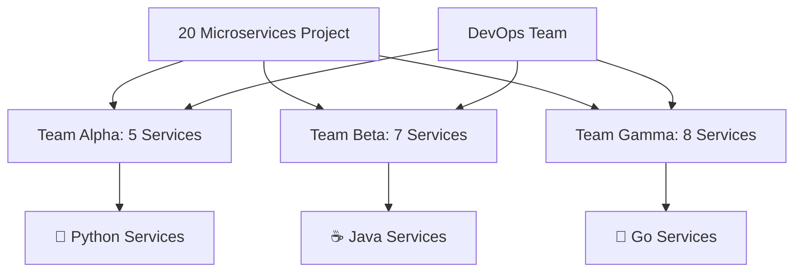
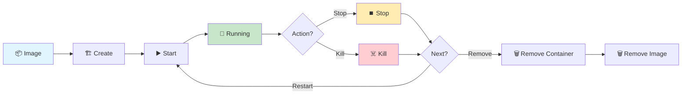
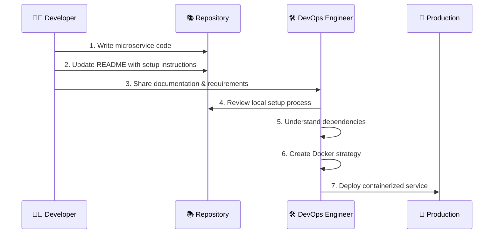
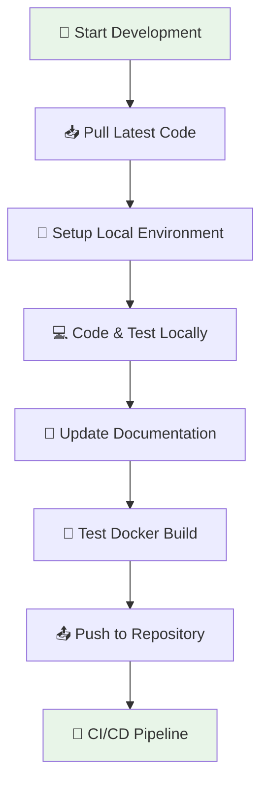

# 🐳 Docker Lifecycle & Team Collaboration Guide

[](https://docker.com/)
[](https://microservices.io/)
[](https://github.com/)

> **Enterprise-scale microservices development**: Understanding Docker lifecycle management and effective developer-DevOps collaboration patterns for multi-language microservices architecture.

## 📋 Table of Contents

- [Project Scale & Team Structure](#-project-scale--team-structure)
- [Docker Container Lifecycle](#-docker-container-lifecycle)
- [Developer-DevOps Collaboration](#-developer-devops-collaboration)
- [Language-Specific Dependencies](#-language-specific-dependencies)
- [Running Projects Locally](#-running-projects-locally)
- [Best Practices](#-best-practices)
- [Common Workflows](#-common-workflows)

## 🏗️ Project Scale & Team Structure

### Real-World Scenario

In enterprise environments, projects typically consist of **20+ microservices** where:

- 🧑‍💻 **No single developer** works on all microservices
- 👥 **Teams are specialized** by service domains
- 🔄 **Cross-team collaboration** is essential
- 📚 **Documentation standards** are critical

### Team Distribution Example



## 🔄 Docker Container Lifecycle

### Complete Lifecycle Flow



### Detailed Lifecycle States

| State | Description | Commands | Use Case |
|-------|-------------|----------|----------|
| 📦 **Image** | Base template for containers | `docker build`, `docker pull` | Template creation |
| 🏗️ **Create** | Container created but not started | `docker create` | Pre-configuration |
| ▶️ **Start** | Container begins execution | `docker start` | Service activation |
| 🏃 **Running** | Active container serving requests | `docker ps` | Production state |
| ⏹️ **Stop** | Graceful shutdown | `docker stop` | Maintenance mode |
| ☠️ **Kill** | Force termination | `docker kill` | Emergency stop |
| 🗑️ **Remove** | Container cleanup | `docker rm`, `docker rmi` | Resource cleanup |

## 🤝 Developer-DevOps Collaboration

### Collaboration Workflow



### 🚫 **Don't Jump to Docker Immediately!**

**❌ Wrong Approach:**
```bash
# Immediately creating Dockerfile without understanding the app
FROM python:3.9
COPY . .
RUN pip install -r requirements.txt  # What if this fails?
```

**✅ Correct Approach:**
1. **Understand the application first**
2. **Run it locally without Docker**
3. **Document all dependencies**
4. **Then containerize**

### Repository Structures

#### MonoRepo Pattern (Recommended for Large Teams)
```
microservices-monorepo/
├── 📁 user-service/           # Python microservice
│   ├── src/
│   ├── requirements.txt
│   └── README.md
├── 📁 payment-service/        # Java microservice
│   ├── src/main/java/
│   ├── pom.xml
│   └── README.md
├── 📁 notification-service/   # Go microservice
│   ├── cmd/
│   ├── go.mod
│   └── README.md
└── 📄 docker-compose.yml
```

#### Multi-Repo Pattern
```
organization/
├── 📦 user-service-repo
├── 📦 payment-service-repo  
├── 📦 notification-service-repo
└── 📦 infrastructure-repo
```

## 📦 Language-Specific Dependencies

### Dependency Management by Language

| Language | Dependency File | Package Manager | Runtime Version |
|----------|----------------|-----------------|-----------------|
| 🐍 **Python** | `requirements.txt` / `pyproject.toml` | pip / poetry | Python 3.8+ |
| ☕ **Java** | `pom.xml` / `build.gradle` | Maven / Gradle | JDK 11+ |
| 🐹 **Go** | `go.mod` / `go.sum` | go modules | Go 1.19+ |
| 🟨 **Node.js** | `package.json` / `package-lock.json` | npm / yarn | Node 16+ |
| 🦀 **Rust** | `Cargo.toml` / `Cargo.lock` | cargo | Rust 1.65+ |
| 💎 **Ruby** | `Gemfile` / `Gemfile.lock` | bundler | Ruby 3.0+ |

### Example Dependency Files

#### Python - `requirements.txt`
```txt
fastapi==0.104.1
uvicorn[standard]==0.24.0
sqlalchemy==2.0.23
psycopg2-binary==2.9.7
redis==5.0.1
pytest==7.4.3
```

#### Java - `pom.xml`
```xml
<dependencies>
    <dependency>
        <groupId>org.springframework.boot</groupId>
        <artifactId>spring-boot-starter-web</artifactId>
        <version>3.1.5</version>
    </dependency>
    <dependency>
        <groupId>org.springframework.boot</groupId>
        <artifactId>spring-boot-starter-data-jpa</artifactId>
        <version>3.1.5</version>
    </dependency>
</dependencies>
```

#### Go - `go.mod`
```go
module github.com/company/notification-service

go 1.21

require (
    github.com/gin-gonic/gin v1.9.1
    github.com/lib/pq v1.10.9
    github.com/redis/go-redis/v9 v9.3.0
    go.uber.org/zap v1.26.0
)
```

## 🚀 Running Projects Locally

### Before Dockerizing - Local Setup Commands

#### Python Projects
```bash
# 1. Check Python version
python --version  # or python3 --version

# 2. Create virtual environment
python -m venv venv
source venv/bin/activate  # On Windows: venv\Scripts\activate

# 3. Install dependencies
pip install -r requirements.txt

# 4. Run application
python app.py
# or
uvicorn main:app --reload --port 8000
```

#### Java Projects (Spring Boot)
```bash
# 1. Check Java version
java -version
javac -version

# 2. Using Maven
mvn clean install
mvn spring-boot:run

# 3. Using Gradle
./gradlew clean build
./gradlew bootRun

# 4. Direct JAR execution
java -jar target/app-name-1.0.jar
```

#### Go Projects
```bash
# 1. Check Go version
go version

# 2. Download dependencies
go mod download
go mod tidy

# 3. Run application
go run main.go

# 4. Build and run
go build -o app
./app
```

#### Node.js Projects
```bash
# 1. Check Node version
node --version
npm --version

# 2. Install dependencies
npm install
# or
yarn install

# 3. Run application
npm start
# or
npm run dev
# or
yarn dev
```

### Environment Setup Checklist

#### 📋 Pre-Development Checklist

- [ ] **Language runtime installed** (correct version)
- [ ] **Package manager available** (pip, maven, npm, etc.)
- [ ] **Database connections** configured
- [ ] **Environment variables** set
- [ ] **External services** accessible (Redis, message queues)
- [ ] **Development tools** installed (IDE, debugger)

## 💡 Best Practices

### 🎯 Developer Responsibilities

```markdown
## Service: User Authentication API

### Prerequisites
- Python 3.9+
- PostgreSQL 13+
- Redis 6+

### Local Development Setup
1. Install dependencies: `pip install -r requirements.txt`
2. Set environment variables: `cp .env.example .env`
3. Run migrations: `python manage.py migrate`
4. Start server: `uvicorn main:app --reload`

### Testing
- Unit tests: `pytest tests/`
- Integration tests: `pytest tests/integration/`

### API Endpoints
- Health check: `GET /health`
- Login: `POST /auth/login`
- Register: `POST /auth/register`
```

### 🛠️ DevOps Integration Points

1. **Documentation Review**
   ```bash
   # Always test the developer's setup instructions
   cd user-service/
   cat README.md
   # Follow the exact steps provided
   ```

2. **Dependency Analysis**
   ```bash
   # Check for security vulnerabilities
   pip audit                    # Python
   mvn dependency:check         # Java
   npm audit                    # Node.js
   go list -m all              # Go
   ```

3. **Multi-Stage Docker Strategy**
   ```dockerfile
   # Build stage
   FROM python:3.9-slim as builder
   COPY requirements.txt .
   RUN pip install --user -r requirements.txt
   
   # Production stage
   FROM python:3.9-slim
   COPY --from=builder /root/.local /root/.local
   COPY . .
   CMD ["python", "app.py"]
   ```

## 🔧 Common Workflows

### Daily Development Cycle



### Team Coordination

| Role | Responsibility | Deliverable |
|------|----------------|-------------|
| **Developer** | Code implementation | ✅ Working local setup + README |
| **DevOps** | Infrastructure & deployment | ✅ Docker containers + CI/CD |
| **QA** | Testing & validation | ✅ Test reports + bug reports |
| **Tech Lead** | Architecture decisions | ✅ Technical specifications |

---

## 🎯 Key Takeaways

> **Remember**: Understanding the application locally is the foundation for successful containerization and deployment.

### Success Metrics
- ⏱️ **Reduced onboarding time** for new developers
- 🔄 **Consistent environments** across development and production
- 📚 **Clear documentation** for all services
- 🚀 **Faster deployment cycles**

---

<div align="center">

**Master Docker Lifecycle & Team Collaboration** 🚀

[Back to Main Project](../README.md) | [Next: Container Orchestration](./kubernetes-deployment.md)

</div>